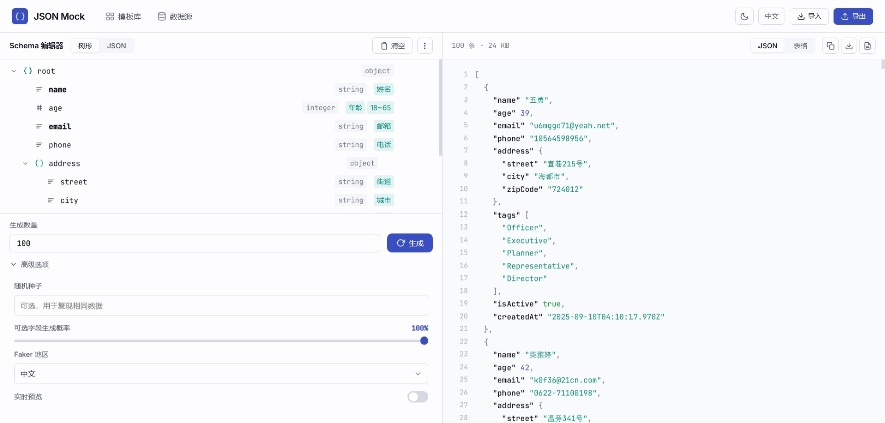
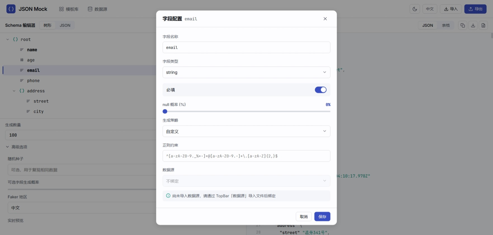

<h1 align="center">JSON Mock</h1>

<p align="center">
  可视化 JSON Schema 编辑器 + Mock 数据生成器，纯前端 SPA，无需后端。
</p>

<p align="center">
  
  
  
  
</p>

<p align="center">
  
</p>

---

## 为什么选择 JSON Mock？

市面上 Mock 工具很多，但大多数要么需要后端服务，要么只能生成英文数据，要么生成规则不够灵活。**JSON Mock** 是一个运行在浏览器里的纯前端工具，专注于让你**最快速度**定义数据结构并拿到可用的 Mock 数据。

| 对比 | 传统 Mock 工具 | JSON Mock |
|------|--------------|-----------|
| 部署 | 需要 Node.js / 后端 | 浏览器打开即用 |
| 语言 | 仅英文 | 中/日/韩/英/德/法/西 7 种语言 |
| 数据源 | 仅内置规则 | 内置规则 + 自定义文件绑定 |
| 可控性 | 固定模板 | 逐字段配置策略/约束/null概率 |
| 协作 | 难以共享配置 | `.json-mock` 一键导出导入 |

---

## 功能亮点

### 1. 多语言 Mock 数据生成

支持 **7 种语言/地区** 的本地化数据生成，不仅仅是翻译，而是符合当地文化的真实数据：

| 语言 | 示例输出 |
|------|----------|
| 中文 (zh_CN) | 张三、北京市朝阳区、13800138000 |
| 日文 (ja) | 田中 太郎、東京都新宿区、090-1234-5678 |
| 韩文 (ko) | 김민수、서울특별시 강남구、010-1234-5678 |
| English | John Doe, New York, (555) 123-4567 |
| Deutsch | Max Mustermann, Berlin, 0170 1234567 |
| Français | Jean Dupont, Paris, 06 12 34 56 78 |
| Español | María García, Madrid, 612 345 678 |


---

### 2. 双模式 Schema 编辑器（可视化 ↔ 文本双向同步）

左侧可视化树形编辑，右侧文本 JSON Schema 编辑，**实时双向同步**。拖拽调整分栏宽度，随心切换编辑模式。

- **可视化模式**：树形结构增删改字段，直观配置每个字段的类型、策略、约束
- **文本模式**：带语法高亮和行号的代码编辑器，支持直接编写 JSON Schema
- **双向同步**：任意一侧修改，另一侧立即更新，保留 `x-faker` 等自定义扩展


---

### 3. 20+ 内置生成策略 + 自定义正则

每种字段类型自动筛选可用策略，还支持自定义正则表达式生成任意格式数据：

| 字段类型 | 可用策略 |
|----------|----------|
| string | 邮箱、姓名、电话、UUID、日期、地址、URL、IP、句子、段落、颜色、身份证、邮政编码、GUID、自定义正则 |
| number / integer | 随机整数、随机浮点数、自定义正则 |
| boolean | 随机布尔值 |
| date | 最近日期、未来日期、过去日期、生日、随机日期 |
| array | 嵌套对象数组 |


---

### 4. 外部数据源绑定（JSON / CSV / TSV / TXT）

导入真实数据文件，将字段绑定到数据源列，支持两种抽取模式：

- **随机抽取**：每次随机从数据源取一条
- **顺序循环**：按序循环取值，适合模拟轮询场景

```
数据源示例:
┌─────────────────────┐
│ name,email,dept     │  ← CSV 文件
│ Alice,a@x.com,IT    │
│ Bob,b@x.com,HR      │
│ Carol,c@x.com,IT    │
└─────────────────────┘
         ↓ 绑定到 schema 字段
   name → 外部数据源(name列)
   email → 外部数据源(email列)
```


---

### 5. 精细化的生成控制

不仅仅是"生成数据"，而是精确控制每一条输出：

- **逐字段 null 概率**：每个字段独立设置 0-100% 的 null 概率（滑块调节）
- **可选字段出现率**：全局控制非必填字段在输出中的出现概率
- **确定性种子**：输入任意字符串（如 `"my-test-suite"`）作为种子，可复现相同结果
- **字符串约束**：最小/最大长度、正则模式
- **数字约束**：最小/最大值、小数位数
- **数组约束**：最小/最大元素个数

<p align="center">
  
</p>

---

### 6. 虚拟化大数据预览

使用 `@tanstack/react-virtual` 实现窗口化渲染，**万级数据**也能流畅滚动。预览模式：

- **JSON 视图**：带语法高亮的格式化 JSON，颜色区分键/字符串/数字/布尔/null
- **表格视图**：自动展开嵌套对象，清晰展示数据
- 实时显示数据条数和文件大小（KB）


---

### 7. 内置模板库 + 自定义模板

**5 个预设模板**助你快速上手，也可以把当前 Schema 保存为自定义模板永久复用：

| 模板 | 字段 |
|------|------|
| 用户 | id, name, email, phone, avatar, createdAt |
| 订单 | orderId, userId, productName, price, quantity, status |
| 产品 | id, name, category, price, stock, description, createdAt |
| 文章 | id, title, author, content, tags, publishDate, viewCount |
| 员工 | id, name, department, position, salary, joinDate, email |


---

### 8. 完整的项目导入/导出

`.json-mock` 格式包含全部项目信息：Schema 树、字段配置、生成设置、数据源、绑定关系。一次导出，在任何电脑上导入即可恢复完整工作环境，方便团队协作。

---

### 9. 多格式数据导出

- **JSON**：一键复制或下载 `.json`
- **CSV**：自动扁平化嵌套结构，下载 `.csv`
- **导出时自定义文件名**

---

### 10. 主题切换 & 国际化 & 可访问性

- **亮色主题**：基于 OKLCH 色彩空间的专业配色
- **国际化**：界面支持 中文/日本語/한국어 三种语言
- **无障碍**：键盘导航、`prefers-reduced-motion` 适配、WCAG 2.1 AA 色比


---

## 快速开始

```bash
# 安装依赖
npm install

# 开发模式（默认 http://localhost:5173）
npm run dev

# 生产构建
npm run build

# 预览构建产物
npm run preview
```

**无后端，无数据库，无环境变量**。

---

## 技术栈

| 技术 | 用途 |
|------|------|
| React 19 + TypeScript 5.7 | UI 框架 |
| Vite 8 | 构建工具 |
| Zustand | 状态管理 + localStorage 持久化 |
| @faker-js/faker | 多语言 Mock 数据生成 |
| @tanstack/react-virtual | 虚拟化大数据渲染 |
| papaparse | CSV/TSV 解析 |
| react-i18next | 国际化 |
| Lucide React | 图标库 |
| CSS Modules + OKLCH | 样式方案 |

---

## 项目结构

```
src/
├── components/
│   ├── DataPreview/        # 数据预览面板（JSON/表格视图）
│   ├── DataSourcePanel/    # 外部数据源管理
│   ├── Modal/              # 模态框 + 字段配置面板
│   ├── PromptDialog/       # 导出文件名对话框
│   ├── SchemaEditor/       # Schema 编辑器（树形 + 文本）
│   ├── Select/             # 自定义下拉组件
│   ├── TemplateLibrary/    # 模板库
│   ├── Toast/              # 提示消息
│   └── TopBar/             # 顶部导航栏
├── constants/
│   ├── demoSchema.ts       # 默认演示 Schema
│   ├── strategies.ts       # 生成策略注册表（22种）
│   └── templates.ts        # 预设模板（5个）
├── store/
│   └── useProjectStore.ts  # Zustand 全局状态
├── types/
│   └── index.ts            # TypeScript 类型定义
├── utils/
│   ├── export.ts           # 导出/复制工具（JSON/CSV）
│   ├── generator.ts        # Mock 数据生成器（核心）
│   ├── schemaConverter.ts  # Schema ↔ JSON Schema 双向转换
│   └── syntaxHighlight.tsx # JSON 语法高亮
├── i18n.ts                 # 国际化初始化
├── App.tsx                 # 根组件
└── index.css               # 全局样式 + 设计令牌
```

---

## 数据源格式

| 格式 | 说明 | 示例 |
|------|------|------|
| JSON | 数组，每元素一条数据 | `["值1","值2"]` 或 `[{"name":"Alice"},...]` |
| CSV | 首行为表头，逗号分隔 | `name,email\nAlice,a@b.com` |
| TSV | 首行为表头，Tab 分隔 | `name\temail\nAlice\ta@b.com` |
| TXT | 每行一个值 | `值1\n值2\n值3` |

`test/` 目录下有示例文件可供测试。

---

## 许可

MIT License © 2026 ALei
